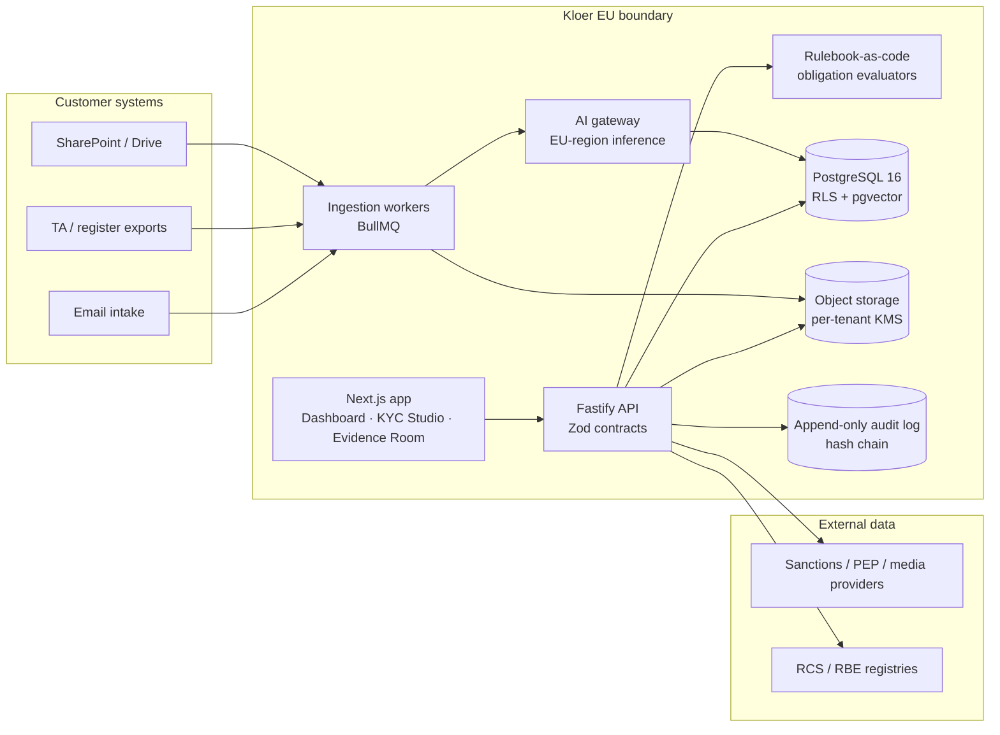
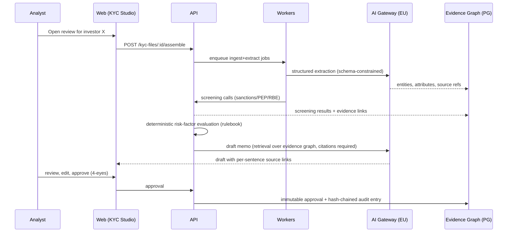
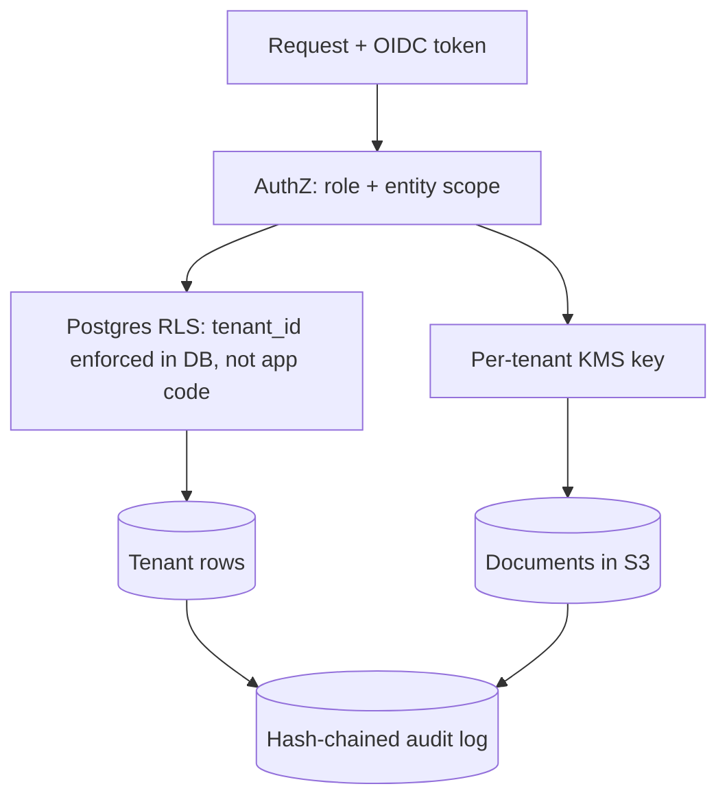

# System Architecture

## 1. High-level system

## 2. KYC Studio pipeline

## 3. Tenant isolation & trust

Principles:
- **Isolation enforced in the database** (RLS), not only in application code — this is
  the line auditors probe first.
- **Nothing leaves the EU boundary**: inference, storage, telemetry all EU-region.
- **Audit log is append-only and hash-chained**; a CSSF inspector can verify
  integrity of the trail independently.
- **LLMs draft, rules decide, humans approve** — the separation is architectural,
  not a policy promise.
